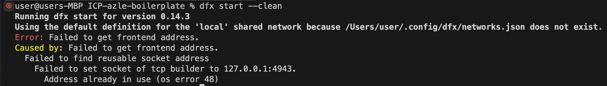

# ICP Music Player Dapp

## Project Description

Basic CRUD dapp modified for music industry. User can create a playlist, add and delete songs, like its favourite music in the dapp.

## Functions

- getList() --> to see its playlist
- getSong() --> to query a song by id in the playlist
- addSong() --> to add a song to the playlist
- markAsFav() --> to like its favourite music
- deleteSong() --> to delete a song from the playlist

## Stake Holders

- artists
- producers
- users

## Further Implementations

ICP Music Player Dapp can be improved by leveraging the power of Spotify API (Web2 integration), Audius(Web3 integration) API.

## To prepare local environment

1. Install Node Version Manager (nvm): Nvm is a useful tool that allows for the management of multiple active Node.js versions. With nvm, switching between different Node.js versions is a breeze. For this tutorial, we'll utilize Node.js version 18. To install nvm, execute the following command in your terminal:

```bash
curl -o- https://raw.githubusercontent.com/nvm-sh/nvm/v0.39.3/install.sh | bash
```

2. Switch to Node.js version 18: Node.js is a JavaScript runtime that enables the execution of JavaScript outside of a browser environment, and it's necessary for running our Azle project. To switch to Node.js version 18 using nvm, use the following command:

```bash
nvm use 18
```

3. Install DFX: DFX is the command-line interface for the Internet Computer, and we'll use it to create our Azle project. To install DFX, execute this command:

```bash
DFX_VERSION=0.14.1 sh -ci "$(curl -fsSL https://sdk.dfinity.org/install.sh)"
```

4. Add DFX to your path: Add DFX to your PATH: Now that DFX is installed, we need to add it to our system's PATH. This allows us to execute DFX commands from any location within the terminal. Run this command to add DFX to your PATH:

```bash
echo 'export PATH="$PATH:$HOME/bin"' >> "$HOME/.bashrc"
```

## To test the Dapp

```bash
git clone https://github.com/umutyorulmaz/ICP-MusicPlayer.git
```

```bash
npm install
```

To start the Local Internet Computer Instance

```bash
dfx start --clean
```

To deploy the canister

```bash
dfx deploy
```

Once the deployment completes, you should see a message indicating the successful deployment of your canisters. The output will include URLs for interacting with your backend canister through the Candid interface. For example:

Deployed canisters.
URLs:
Backend canister via Candid interface:
music_player: http://127.0.0.1:8080/?canisterId=bd3sg-teaaa-aaaaa-qaaba-cai&id=bkyz2-fmaaa-aaaaa-qaaaq-cai

Go to the URL to test the dapp by using candid interface.

Once you finish testing use the command below to stop the Inter Computer instance. It is recommended to do so, in order to free up resources plus avoiding conflicts for the future deployments.

```bash
dfx stop
```

testing of the dapp can be done by using CLI as well. Please see the full lesson linked below to learn more about it.

# Debugging



if you are getting the error above, create the missing networks.json file with the code below in the directory pointed in your terminal where it says missing.

networks.json

```bash
{
  "local": {
    "bind": "127.0.0.1:8080",
    "type": "ephemeral",
    "replica": {
      "subnet_type": "application"
    }
  },
  "ic": {
    "providers": ["https://mainnet.dfinity.network/"],
    "type": "persistent"
  }
}
```

# Resource for the full lesson

https://dacade.org/communities/icp/courses/typescript-smart-contract-101
